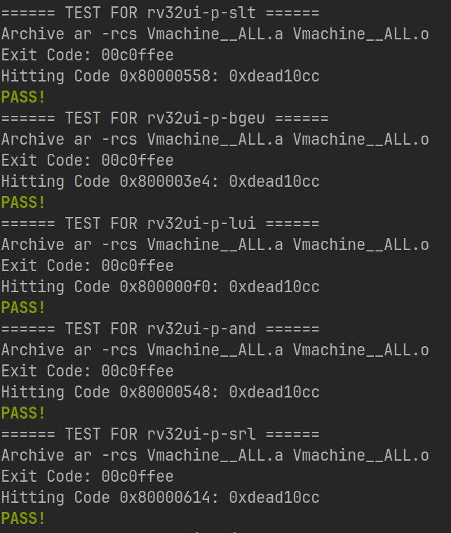

# riscvui-test

This project helps the automatic testing for RV32I cpus. It contains three parts: am-cpu-tests, own-program and rv-tests.

To start your testing, pull this repo first.

## am-cpu-tests

This part uses the `cpu-tests` of [NJU-ProjectN/abstract-machine](https://github.com/NJU-ProjectN/abstract-machine) & [NJU-ProjectN/am-kernels](https://github.com/NJU-ProjectN/am-kernels) for testing.

Before building the tests, make sure that you pull the components of abstract-machine and am-kernels correctly, and `$AM_HOME/../am-kernels/` is exactly your root directory of am-kernels.

### Usage

- Run `make -C am-cpu-tests` directly.
- Refer to `am-cpu-tests/build/NAMES.txt` to obtain the **main name**(denoted by `<MN>` later) for each of the cpu-tests testcase.
- Then use `$readmemh(<MN>.txt, ...)` to load the content of the instructions and data into your memory in verilog, or use `$readmemh(<MN>0/1/2/3.txt, ...)` to load the content of specific bytes of each word of instructions and data in verilog.
- Start your testing! Note that the am-kernels/cpu-tests has RV32M instructions in some of its testcases. And the program ends when it meets `ebreak`(`0x00100073`), with `a0(R[10])` being the returning value. It's wise to identify these cases.

## own-program

This part allows you to add your own programs. The usage is the same as am-cpu-tests, just changing the directory name from `am-cpu-tests` to `own-program`. (In fact, the latter is implemented by this part).

## rv-tests

This part uses the RV official testing set. Some functionalities are added to help with automatic testing.

### Usage

- Run `make -C rv-tests` directly.
- Refer to `rv-tests/build/NAMES.txt` to obtain the **main name**(denoted by `<MN>` later) for each of the cpu-tests testcase.
- Then use `$readmemh(<MN>.hex, ...)` to load the content of the instructions into your memory in verilog, or use `$readmemh(<MN>_d.hex, ...)` to load the content of the data into your memory in verilog, or use `$readmemh(<MN>_d0/1/2/3.hex, ...)` to load the content of specific bytes of each word of data in verilog.
- Start your testing! The instruction to flag the end of program is `0xdead10cc`, with `a0(R[10])` equals to `0xc0ffee` meaning the testing is passed, and `a0(R[10])` equals to `0xdeaddead` meaning the testing failed.

## Automatic testing

The project provides simple automatic test structure at `am-cpu-tests/scripts/test.sh` and `rv-tests/scripts/test.sh`. Feel free to modify and use them. Here is an example of automatic tests on rv-tests, using verilator: 

